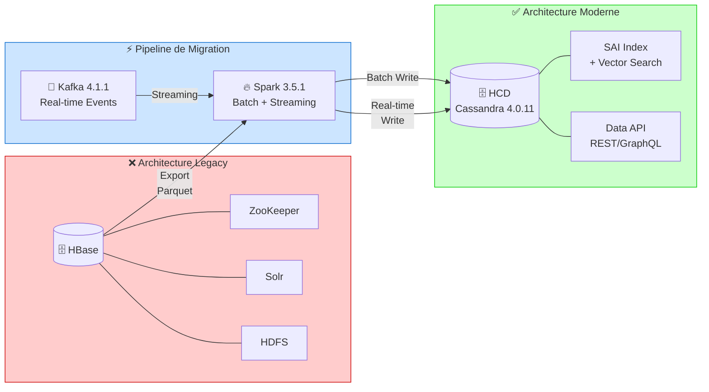

# 🚀 POC Migration HBase → HCD (Hyper-Converged Database)

[](LICENSE)
[](CHANGELOG.md)
[](https://github.com/davidleconte/Arkea/actions/workflows/test.yml)
[](https://github.com/davidleconte/Arkea/actions/workflows/security.yml)
[](https://codecov.io/gh/davidleconte/Arkea)
[](docs/DEPLOYMENT.md)
[](https://github.com/psf/black)

**Date** : 2026-03-13
**Version** : 1.4.1
**Objectif** : Démonstration de faisabilité de la migration HBase vers DataStax HCD
**IBM | Opportunité ICS 006gR000001hiA5QAI - ARKEA | Ingénieur Avant-Vente** :
David LECONTE | <david.leconte1@ibm.com> - Mobile : +33614126117
**License** : [Apache 2.0](LICENSE)

---

> **🇬🇧 English Summary** — This POC demonstrates the feasibility of migrating a legacy HBase architecture to [DataStax HCD](https://www.datastax.com/) (Hyper-Converged Database, Cassandra 4.0.11) using Apache Spark and Kafka. Results: **40–100× faster searches**, **10K+ writes/s**, **75% infrastructure simplification**. Three production use cases validated with **100% requirement conformity**. See [Architecture](docs/ARCHITECTURE.md) · [Evidence](evidence/) · [Quick Start](#-démarrage-rapide)

---

## 📋 Vue d'Ensemble

Ce projet démontre la faisabilité de migrer l'architecture HBase existante chez
Arkéa vers DataStax Hyper-Converged Database (HCD) en utilisant Spark, Kafka et
Cassandra.

### 🏗️ Architecture



### ⚡ Résultats Clés

| Métrique | Legacy (HBase/Solr) | Moderne (HCD/SAI) | Amélioration |
|----------|--------------------|--------------------|-------------|
| **Latence recherche** | 2s – 5s | **< 50ms** | **40× – 100× plus rapide** |
| **Latence lecture** | 100ms – 500ms | **< 50ms** | **5× – 10× plus rapide** |
| **Throughput écriture** | 5K ops/s | **> 10K ops/s** | **2× plus rapide** |
| **Complexité infra** | 5 composants | **1 cluster** | **-75% simplification** |

> 📊 *Détails : [Justification technique](evidence/JUSTIFICATION_RESULTATS_POC_ARKEA.md) · [Synthèse bénéfices](business/SYNTHESE_RESULTATS_BENEFICES_HCD_ARKEA.md)*

### 🎯 Use Cases Validés

| Use Case | Description | Conformité | Points Forts |
|----------|-------------|------------|-------------|
| **BIC** | Base d'Interaction Client | **96.4%** | Timeline conseiller, ingestion Kafka temps réel, TTL automatique |
| **domirama2** | Opérations Bancaires | **103%** | Recherche full-text/fuzzy (SAI), recherche vectorielle, Data API |
| **domiramaCatOps** | Catégorisation Opérations | **104%** | Multi-modèle embeddings, compteurs atomiques, 7 tables optimisées |

---

## 🌍 Plateformes Supportées

Le projet ARKEA est **cross-platform** et supporte les systèmes d'exploitation suivants :

| Plateforme | Statut | Notes |
| ---------- | ------ | ----- |
| **macOS** 12+ | ✅ **Entièrement Supporté** | Testé sur MacBook Pro M3 Pro |
| **Linux** (Ubuntu 20.04+, CentOS 7+) | ✅ **Entièrement Supporté** | Testé dans CI |
| **Windows** (WSL2) | ✅ **Supporté** | Nécessite WSL2 (voir [Guide Windows](docs/GUIDE_INSTALLATION_WINDOWS.md)) |

**Score de Portabilité** : **~90%** ✅

### Guides d'Installation par Plateforme

- 🍎 **macOS** : Voir [Guide de Déploiement](docs/DEPLOYMENT.md)
- 🐧 **Linux** : Voir [Guide d'Installation Linux](docs/GUIDE_INSTALLATION_LINUX.md)
- 🪟 **Windows** : Voir [Guide d'Installation Windows](docs/GUIDE_INSTALLATION_WINDOWS.md)

### Fonctionnalités Cross-Platform

- ✅ **Détection automatique de l'OS** via `$OSTYPE`
- ✅ **Chemins portables** (pas de chemins hardcodés)
- ✅ **Fonctions utilitaires portables** (`get_realpath`, `check_port`, `kill_process`)
- ✅ **Configuration centralisée** (`.poc-config.sh`)
- ✅ **Installation automatique** selon la plateforme

---

### Composants Principaux

- **HCD 1.2.3** - Base de données cible (basée sur Cassandra 4.0.11)
- **Spark 3.5.1** - Traitement distribué et streaming
- **Kafka 4.1.1** - Streaming de données
- **spark-cassandra-connector 3.5.0** - Intégration Spark ↔ HCD

---

## 🚀 Démarrage Rapide

```bash
# 1. Cloner et configurer
git clone https://github.com/davidleconte/Arkea.git && cd Arkea
make setup              # Configure l'environnement

# 2. Démarrer les services
make start              # Démarre HCD + Kafka

# 3. Lancer les tests
make test               # 130 tests, 100% coverage

# 4. Lancer la démo complète
make demo               # One-shot showcase: load → query → stream → results
```

> **⏱️ Temps total** : ~5 minutes (setup) + ~2 minutes (demo)

---

## 🏗️ Structure du Projet

```text
Arkea/
├── scripts/             # Scripts organisés
│   ├── setup/           # Scripts d'installation/setup (01-06)
│   ├── utils/           # Scripts utilitaires (70-90)
│   └── scala/           # Scripts/test Scala
├── schemas/             # Schémas CQL
│   └── kafka/           # Schémas Kafka
├── tests/               # Tests automatisés
│   ├── unit/            # Tests unitaires
│   ├── integration/     # Tests d'intégration
│   ├── e2e/             # Tests end-to-end
│   ├── fixtures/        # Données de test
│   └── utils/           # Framework de tests
├── .github/             # GitHub Actions workflows
│   └── workflows/       # CI/CD
├── inputs-clients/       # Documents fournis par le client
├── inputs-ibm/           # Documents fournis par IBM
├── software/             # Archives des logiciels (.tar.gz, .tgz)
├── binaire/              # Logiciels extraits et installés
├── docs/                 # Documentation complète
├── poc-design/           # POCs de démonstration
├── logs/                 # Logs organisés
│   ├── archive/         # Logs archivés
│   └── current/         # Logs actuels
├── LICENSE               # Licence Apache 2.0
├── CONTRIBUTING.md       # Guide de contribution
├── CHANGELOG.md          # Suivi des versions
├── requirements.txt      # Dépendances Python (production)
├── requirements-dev.txt  # Dépendances Python (développement)
├── .editorconfig         # Configuration éditeur
├── .pre-commit-config.yaml # Hooks pre-commit
├── .poc-profile          # Configuration (source manuel)
└── .poc-config.sh        # Configuration centralisée (auto-chargée)
```

**Voir** `docs/GUIDE_STRUCTURE.md` pour la structure complète.

---

## 🚀 Démarrage Rapide — Configuration Détaillée

### 1. Configuration de l'Environnement

```bash
cd /path/to/Arkea
source .poc-profile
check_poc_env
```

**Note** : Le projet utilise maintenant `.poc-config.sh` pour une configuration
portable. Voir `docs/PLAN_ACTION_FACTORISATION_CONFIG.md` pour les détails.

### 2. Installation des Dépendances

```bash
# Installer les dépendances Python
pip install -r requirements.txt

# Pour le développement (optionnel)
pip install -r requirements-dev.txt
```

### 3. Installation des Composants

```bash
# Installer HCD
./scripts/setup/01_install_hcd.sh

# Installer Spark et Kafka
./scripts/setup/02_install_spark_kafka.sh
```

### 4. Démarrage des Services

```bash
# Démarrer HCD
./scripts/setup/03_start_hcd.sh background

# Démarrer Kafka
./scripts/setup/04_start_kafka.sh background
```

### 5. Configuration et Test

```bash
# Configurer le streaming Kafka → HCD
./scripts/setup/05_setup_kafka_hcd_streaming.sh

# Tester le pipeline complet
./scripts/setup/06_test_kafka_hcd_streaming.sh
```

---

## 📚 Documentation

Toute la documentation est dans le répertoire `docs/` :

### Guides Principaux

- **GUIDE_CHOIX_POC.md** - Guide pour choisir entre BIC, domirama2, domiramaCatOps
- **GUIDE_COMPARAISON_POCS.md** - Comparaison technique détaillée des POCs
- **GUIDE_CONTRIBUTION_POCS.md** - Standards pour contribuer aux POCs
- **GUIDE_MAINTENANCE.md** - Processus de maintenance et archivage
- **GUIDE_DEPENDENCIES.md** - Guide complet des dépendances Python et Java
- **ARCHITECTURE.md** - Architecture complète (composants, flux, décisions)
- **DEPLOYMENT.md** - Guide de déploiement complet
- **TROUBLESHOOTING.md** - Guide de dépannage (problèmes courants, solutions, FAQ)
- **GUIDE_STRUCTURE.md** - Structure complète du projet
- **ORDRE_EXECUTION_SCRIPTS.md** - Guide d'exécution des scripts

### Guides Spécialisés

- **GUIDE_INSTALLATION_*** - Guides d'installation (HCD, Spark, Kafka)
- **GUIDE_CHANGELOG.md** - Guide pour maintenir le CHANGELOG
- **INSTALLATION_SHELLCHECK.md** - Installation de ShellCheck
- **ARCHITECTURE_POC_COMPLETE.md** - Architecture technique détaillée
- **ANALYSE_ETAT_ART_HBASE.md** - Analyse de l'existant

Voir `docs/README.md` pour l'index complet.

### 👔 Business & Executive Synthesis

- [SYNTHESE_USE_CASES_POC.md](SYNTHESE_USE_CASES_POC.md) — Vue d’ensemble des use cases PoC
- [business/ANALYSE_BENEFICES_ARKEA_MIGRATION_HCD.md](business/ANALYSE_BENEFICES_ARKEA_MIGRATION_HCD.md) — Analyse détaillée des bénéfices/ROI
- [business/DISTINCTION_BENEFICES_VS_IMPACTS_ARKEA.md](business/DISTINCTION_BENEFICES_VS_IMPACTS_ARKEA.md) — Distinction bénéfices vs impacts
- [business/SYNTHESE_RESULTATS_BENEFICES_HCD_ARKEA.md](business/SYNTHESE_RESULTATS_BENEFICES_HCD_ARKEA.md) — Synthèse des résultats/bénéfices

### 📊 Results & Evidence

- [evidence/JUSTIFICATION_RESULTATS_POC_ARKEA.md](evidence/JUSTIFICATION_RESULTATS_POC_ARKEA.md) — Justification et traçabilité des résultats
- [evidence/SYNTHESE_TESTS_VECTOR_HYBRID_SEARCH_POC_ARKEA.md](evidence/SYNTHESE_TESTS_VECTOR_HYBRID_SEARCH_POC_ARKEA.md) — Synthèse des tests vector/hybrid search
- [evidence/NOMBRE_EXIGENCES_PAR_USE_CASE_POC_ARKEA.md](evidence/NOMBRE_EXIGENCES_PAR_USE_CASE_POC_ARKEA.md) — Couverture des exigences par use case

---

## 🛠️ Scripts Disponibles

### Installation (scripts/setup/)

- `01_install_hcd.sh` - Installe HCD
- `02_install_spark_kafka.sh` - Installe Spark et Kafka
- `03_start_hcd.sh` - Démarre HCD
- `04_start_kafka.sh` - Démarre Kafka
- `05_setup_kafka_hcd_streaming.sh` - Configure le streaming
- `06_test_kafka_hcd_streaming.sh` - Test du pipeline

### Utilitaires (scripts/utils/)

- `70_kafka-helper.sh` - Helper pour Kafka
- `80_verify_all.sh` - Vérifie tous les composants
- `90_list_scripts.sh` - Liste tous les scripts
- `91_check_consistency.sh` - Vérification de cohérence (chemins hardcodés, scripts, documentation)
- `92_generate_docs.sh` - Génération automatique de documentation (index, listes, tableaux)
- `93_fix_hardcoded_paths.sh` - Correction automatique des chemins hardcodés
- `95_cleanup.sh` - Nettoyage automatique (UNLOAD_*, fichiers temporaires, logs anciens)

### Tests Scala (scripts/scala/)

- `test_spark_hcd.scala` - Tests Spark ↔ HCD
- `test_spark_hcd_connection.scala` - Tests de connexion
- `kafka_to_hcd_streaming.scala` - Streaming Kafka → HCD

---

## ⚙️ Configuration

Le fichier `.poc-profile` contient toutes les variables d'environnement nécessaires :

```bash
source .poc-profile
```

Voir `docs/CONFIGURATION_ENVIRONNEMENT.md` pour les détails.

---

## 📊 Objectifs du POC

1. ✅ **Maîtrise de l'existant** - Analyse HBase/MR/Kafka/Elastic
2. ✅ **POC Spark + Cassandra/HCD** - Schémas réalistes, données simulées
3. 🔄 **Réutilisation de la logique métier** - Adaptation de `recurrentDetection` pour Spark
4. 🔄 **Design de migration** - Stratégies HBase → HCD, documentation MECE

---

## 🔍 Vérification

```bash
# Vérifier l'état de tous les composants
./scripts/utils/80_verify_all.sh

# Lister tous les scripts
./scripts/utils/90_list_scripts.sh
```

---

## 📝 Prérequis

### Système d'Exploitation

- **macOS** 12+ (testé sur MacBook Pro M3 Pro)
- **Linux** (Ubuntu 20.04+, CentOS 7+)
- **Windows** (WSL2)

### Logiciels Requis

- **Java 11** (pour HCD et Spark 3.5.1)
- **Java 17** (pour Kafka 4.1.1, optionnel)
- **Python 3.8-3.11** (pour scripts et tests)
- **pip** (pour installer les dépendances Python)
- **Homebrew** (pour Kafka sur macOS)
- **jenv** (recommandé pour gérer les versions Java)

### Dépendances Python

Les dépendances Python sont gérées via `requirements.txt` :

```bash
pip install -r requirements.txt
```

Voir `docs/GUIDE_DEPENDENCIES.md` pour la liste complète des dépendances.

---

## 🧪 Tests

Le projet inclut une structure de tests complète avec framework réutilisable :

### Framework de Tests

Un framework de tests réutilisable est disponible dans
`tests/utils/test_framework.sh` avec des fonctions d'assertion :

- `assert_equal()`, `assert_not_equal()`
- `assert_file_exists()`, `assert_dir_exists()`
- `assert_port_open()`, `assert_command_exists()`
- `assert_var_defined()`, `assert_file_contains()`

### Exécution des Tests

```bash
# Exécuter tous les tests
./tests/run_all_tests.sh

# Tests unitaires
./tests/run_unit_tests.sh
# - test_portability.sh : Tests de portabilité cross-platform
# - test_consistency.sh : Tests de cohérence du projet
# - test_poc_config.sh : Tests de configuration POC
# - test_portable_functions_example.sh : Exemple de tests pour fonctions portables

# Tests d'intégration
./tests/run_integration_tests.sh
# - test_poc_structure.sh : Tests de structure des POCs
# - test_hcd_spark.sh : Tests d'intégration HCD ↔ Spark

# Tests E2E
./tests/run_e2e_tests.sh
# - test_kafka_hcd_pipeline.sh : Test end-to-end pipeline Kafka → HCD

# Tests de portabilité
./tests/run_portability_tests.sh

# Tests de cohérence
./tests/run_consistency_tests.sh
```

Voir `tests/README.md` pour plus de détails.

---

## 🔧 Qualité de Code

### Pre-commit Hooks

Le projet utilise [pre-commit](https://pre-commit.com/) pour valider le code automatiquement :

```bash
# Installation (déjà fait si vous avez suivi le guide)
pip3 install pre-commit
pre-commit install

# Test manuel
pre-commit run --all-files
```

**Hooks configurés** :

- ✅ ShellCheck (linting shell)
- ✅ Black, isort, flake8 (Python)
- ✅ Markdownlint (Markdown)
- ✅ YAMLLint (YAML)
- ✅ Validation de fichiers (JSON, TOML, etc.)

### GitHub Actions

CI/CD automatique configuré (`.github/workflows/`) :

- ✅ **Tests unitaires** : Exécution automatique des tests unitaires
- ✅ **Tests d'intégration** : Tests avec services Docker (Cassandra)
- ✅ **Tests multi-OS** : Ubuntu et macOS
- ✅ **Tests de régression** : Détection automatique des régressions
- ✅ **Tests de syntaxe** : Validation de syntaxe shell et Python
- ✅ **Validation de configuration** : Vérification des fichiers de config
- ✅ **Linting automatique** : ShellCheck, Black, isort, flake8
- ✅ **Vérification de structure** : Validation de la structure du projet
- ✅ **Génération de rapports** : Rapports automatiques des tests
- ✅ **Upload d'artifacts** : Sauvegarde des résultats de tests

Voir `.github/workflows/tests.yml` pour plus de détails.

---

## 🤝 Contribution

Le projet suit les standards de contribution :

- **CONTRIBUTING.md** - Guide complet de contribution
- **CHANGELOG.md** - Suivi des versions (format Keep a Changelog)
- **LICENSE** - Apache 2.0

**Processus** :

1. Fork le projet
2. Créer une branche (`feature/nom` ou `fix/nom`)
3. Commiter avec messages clairs (voir CONTRIBUTING.md)
4. Pousser et créer une Pull Request

---

## 📖 Pour Plus d'Informations

- Documentation complète : `docs/`
- Architecture : `docs/ARCHITECTURE.md`
- Déploiement : `docs/DEPLOYMENT.md`
- Dépannage : `docs/TROUBLESHOOTING.md`
- Structure : `docs/GUIDE_STRUCTURE.md`
- Configuration : `docs/CONFIGURATION_ENVIRONNEMENT.md`
- Contribution : `CONTRIBUTING.md`
- Changelog : `CHANGELOG.md`

---

## ✅ Statut

### Infrastructure

- ✅ Infrastructure installée et opérationnelle
- ✅ Pipeline Kafka → HCD fonctionnel
- ✅ Configuration centralisée et portable

### Qualité et Tests

- ✅ **Framework de tests** : Framework réutilisable avec fonctions d'assertion
- ✅ **Tests unitaires** : 4+ fichiers de tests unitaires
- ✅ **Tests d'intégration** : 2+ fichiers de tests d'intégration
- ✅ **Tests E2E** : Tests end-to-end pour pipeline complet
- ✅ **Pre-commit hooks** : Configurés (ShellCheck, Black, isort, flake8)
- ✅ **GitHub Actions CI/CD** : Tests automatisés multi-OS avec régression
- ✅ **Documentation complète** : Guides et documentation à jour

### Conformité

- ✅ License Apache 2.0
- ✅ Guide de contribution
- ✅ CHANGELOG maintenu
- ✅ Standards de code (`.editorconfig`)

### Développement

- ✅ Tests unitaires et d'intégration implémentés
- ✅ Framework de tests créé
- ✅ Fichiers de dépendances créés
- ✅ CI/CD enrichi avec tests automatisés
- 🔄 Schémas Domirama/BIC à créer
- 🔄 Jobs Spark métier à développer

---

## 📊 Métriques

- **Score de conformité** : ~94-95% (bonnes pratiques) ✅
- **Documentation** : Complète et à jour ✅
- **Tests** : Framework créé, 7+ fichiers de tests implémentés ✅
- **CI/CD** : Tests automatisés multi-OS avec régression ✅
- **Dépendances** : Fichiers requirements.txt créés ✅

---

**POC opérationnel, conforme aux bonnes pratiques et prêt pour le développement !** 🚀
