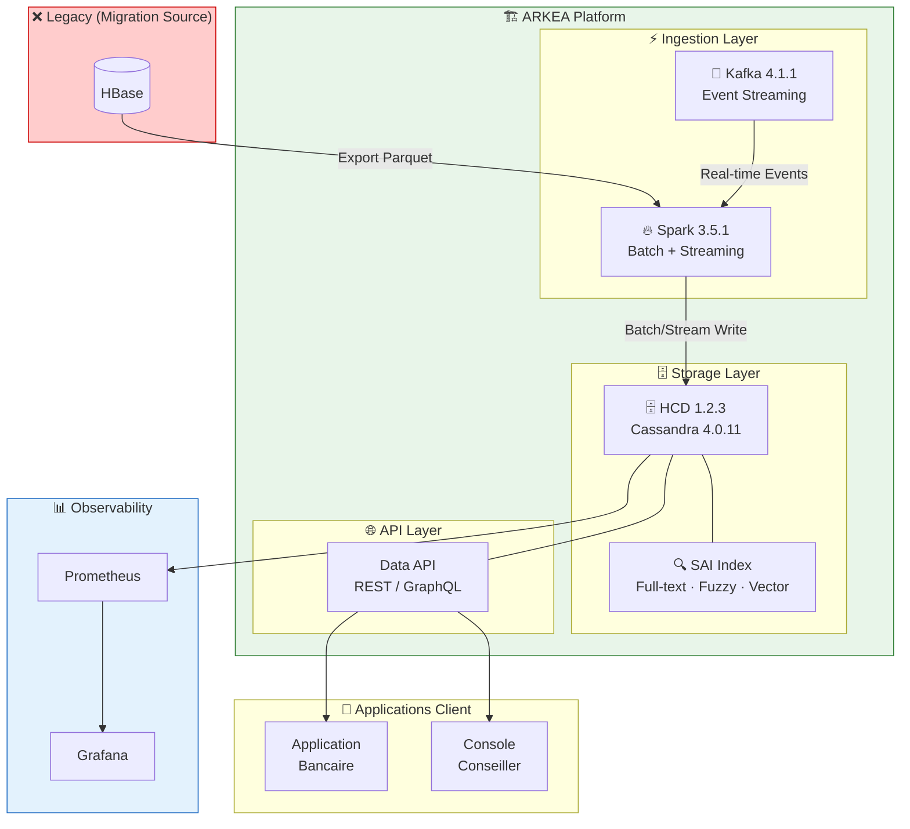
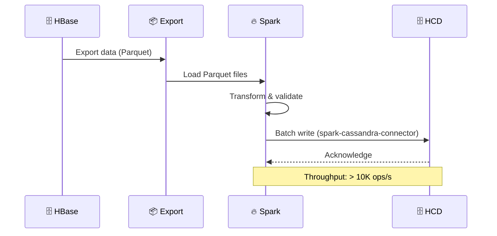
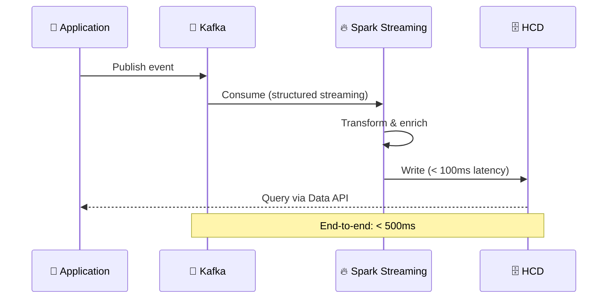
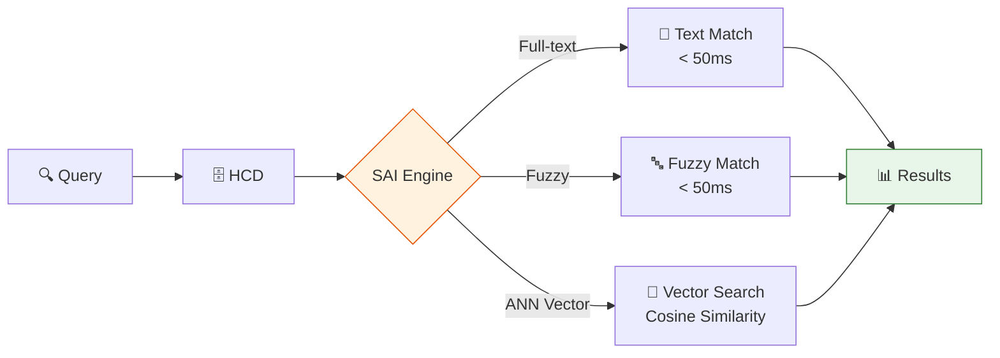

# 🏛️ Architecture - ARKEA

**Date** : 2026-03-13
**Objectif** : Architecture complète du projet ARKEA
**Version** : 1.0

---

## 📋 Table des Matières

- [Vue d'Ensemble](#vue-densemble)
- [Composants Principaux](#composants-principaux)
- [Flux de Données](#flux-de-données)
- [Architecture Technique](#architecture-technique)
- [Décisions Architecturales](#décisions-architecturales)

---

## 🎯 Vue d'Ensemble

Le projet **ARKEA** est un Proof of Concept (POC) démontrant la faisabilité de migrer une architecture HBase existante vers **DataStax Hyper-Converged Database (HCD)**.

### Objectif Principal

**Migrer** l'architecture HBase → HCD en conservant :

- ✅ Fonctionnalités existantes
- ✅ Performance équivalente ou supérieure
- ✅ Compatibilité avec les applications existantes

---

## 🧩 Composants Principaux

### 1. HCD (Hyper-Converged Database) 1.2.3

**Rôle** : Base de données cible (basée sur Cassandra 4.0.11)

**Caractéristiques** :

- ✅ Stockage distribué
- ✅ SAI (Storage-Attached Index) pour recherche avancée
- ✅ Support full-text, fuzzy, vector search
- ✅ Data API (REST/GraphQL)

**Configuration** :

- Host : `localhost` (configurable via `HCD_HOST`)
- Port : `9042` (configurable via `HCD_PORT`)
- Keyspace : `poc_hbase_migration` (configurable via `POC_KEYSPACE`)

**Répertoire** : `binaire/hcd-1.2.3/`

---

### 2. Spark 3.5.1

**Rôle** : Traitement distribué et streaming

**Caractéristiques** :

- ✅ Batch processing (chargement de données)
- ✅ Streaming (Kafka → HCD)
- ✅ Spark SQL pour requêtes
- ✅ Intégration avec HCD via `spark-cassandra-connector`

**Configuration** :

- Version : 3.5.1
- Connector : `spark-cassandra-connector_2.12-3.5.0`
- Packages : `spark-sql-kafka-0-10_2.12:3.5.1`

**Répertoire** : `binaire/spark-3.5.1/`

---

### 3. Kafka 4.1.1

**Rôle** : Streaming de données en temps réel

**Caractéristiques** :

- ✅ Topics pour événements
- ✅ Intégration Spark Streaming
- ✅ Persistence des messages

**Configuration** :

- Bootstrap Servers : `localhost:9092` (configurable via `KAFKA_BOOTSTRAP_SERVERS`)
- Zookeeper : `localhost:2181` (configurable via `KAFKA_ZOOKEEPER_CONNECT`)

**Répertoire** : `binaire/kafka/` (lien symbolique vers Homebrew)

---

### 4. DSBulk

**Rôle** : Chargement de données en masse

**Caractéristiques** :

- ✅ Import/Export CSV, JSON
- ✅ Optimisé pour Cassandra/HCD
- ✅ Support parallélisme

**Répertoire** : `binaire/dsbulk/`

---

## 🔄 Flux de Données

### Vue d'Ensemble (C4 — Context)



### Flux Principal : HBase → HCD (Batch)



### Flux Streaming : Kafka → HCD (Real-time)



### Flux Recherche : SAI + Vector Search



### Flux Recherche (Legacy — ASCII)

```text
┌─────────┐
│ Client  │ (Application)
└────┬────┘
     │ Requête
     ▼
┌─────────┐
│   HCD   │ (SAI Index)
└────┬────┘
     │ Résultats
     ▼
┌─────────┐
│ Client  │ (Réponse)
└─────────┘
```

---

## 🏗️ Architecture Technique

### Structure des Répertoires

```text
Arkea/
├── scripts/              # Scripts d'automatisation
│   ├── setup/           # Installation et configuration
│   ├── utils/           # Utilitaires
│   └── scala/           # Scripts Spark/Scala
│
├── schemas/             # Schémas CQL
│   └── kafka/           # Schémas Kafka
│
├── binaire/             # Logiciels installés
│   ├── hcd-1.2.3/       # HCD
│   ├── spark-3.5.1/     # Spark
│   └── dsbulk/          # DSBulk
│
├── poc-design/          # POCs de démonstration
│   ├── domirama2/        # POC Domirama v2 (remplace domirama/)
│   ├── domiramaCatOps/   # POC Catégorisation
│   └── bic/              # POC BIC (Base d'Interaction Client)
│
├── docs/                 # Documentation
├── logs/                 # Logs
└── data/                 # Données temporaires
```

### Configuration Centralisée

**`.poc-config.sh`** :

- Variables d'environnement centralisées
- Détection automatique de l'OS (macOS/Linux)
- Priorité : Variables d'env > Fichier > Détection auto

**`.poc-profile`** :

- Source `.poc-config.sh`
- Fonctions utilitaires
- Initialisation de l'environnement

---

## 🎨 Patterns Architecturaux

### 1. Multi-Version / Time Travel

**Objectif** : Gérer différentes versions de données (batch vs. client)

**Implémentation** :

- Colonne `version` dans les tables
- Timestamps pour traçabilité
- Requêtes avec filtrage par version

### 2. SAI (Storage-Attached Index)

**Objectif** : Recherche avancée (full-text, fuzzy, vector)

**Types d'index** :

- **Full-text** : Recherche textuelle classique
- **Fuzzy** : Tolérance aux fautes de frappe
- **Vector** : Recherche sémantique (embeddings)

### 3. Hybrid Search

**Objectif** : Combiner full-text et vector search

**Implémentation** :

- Requêtes combinant SAI full-text et vector
- Scoring unifié
- Optimisation de la pertinence

---

## 🔐 Sécurité

### Authentification

- **HCD** : Authentification Cassandra standard
- **Data API** : Token-based authentication
- **Kafka** : SASL/SSL (optionnel)

### Configuration

- Variables sensibles via variables d'environnement
- Pas de secrets hardcodés
- `.gitignore` pour fichiers locaux

---

## 📊 Performance

### Optimisations

- ✅ **Parquet** : Format columnar pour exports
- ✅ **Compaction** : Gestion automatique des tombstones
- ✅ **Indexing** : SAI pour recherche rapide
- ✅ **Batch Loading** : Spark pour chargement massif

### Monitoring

- Logs dans `logs/`
- Métriques HCD via `nodetool`
- Métriques Spark via UI (port 4040)

---

## 🚀 Scalabilité

### Horizontal Scaling

- **HCD** : Cluster multi-nœuds
- **Spark** : Cluster distribué
- **Kafka** : Partitionnement des topics

### Vertical Scaling

- Configuration des ressources (mémoire, CPU)
- Tuning des paramètres JVM

---

## 📝 Décisions Architecturales

### ADR-001 : Choix de HCD

**Contexte** : Migration HBase → HCD

**Décision** : Utiliser HCD 1.2.3 (basé sur Cassandra 4.0.11)

**Justification** :

- ✅ Compatibilité avec écosystème Cassandra
- ✅ SAI pour recherche avancée
- ✅ Data API pour modernisation
- ✅ Support DataStax

**Conséquences** :

- Nécessite adaptation des schémas HBase → CQL
- Migration des données via Spark

---

### ADR-002 : Format Parquet pour Exports

**Contexte** : Format d'export des données

**Décision** : Utiliser Parquet au lieu de CSV

**Justification** :

- ✅ Performance supérieure (columnar)
- ✅ Compression efficace
- ✅ Support natif Spark
- ✅ Schéma préservé

**Conséquences** :

- Nécessite conversion CSV → Parquet
- Outils compatibles Parquet requis

---

### ADR-003 : Configuration Centralisée

**Contexte** : Gestion des chemins et variables

**Décision** : `.poc-config.sh` avec détection automatique

**Justification** :

- ✅ Portabilité (macOS/Linux)
- ✅ Maintenance facilitée
- ✅ Priorité claire (env > config > auto)

**Conséquences** :

- Migration des scripts existants
- Documentation à jour

---

## 🔄 Évolution Future

### Court Terme

- ✅ Tests automatisés
- ✅ CI/CD complet
- ✅ Documentation complète

### Moyen Terme

- 🔄 Déploiement en production
- 🔄 Monitoring avancé
- 🔄 Optimisations performance

### Long Terme

- 🔄 Multi-cluster
- 🔄 Disaster recovery
- 🔄 Backup/restore automatisé

---

## 📚 Références

- `docs/ARCHITECTURE_POC_COMPLETE.md` - Architecture détaillée du POC
- `docs/DEPLOYMENT.md` - Guide de déploiement
- `docs/TROUBLESHOOTING.md` - Guide de dépannage
- `README.md` - Vue d'ensemble du projet

---

**Date** : 2026-03-13
**Version** : 1.0
**Statut** : ✅ **Documentation complète**
