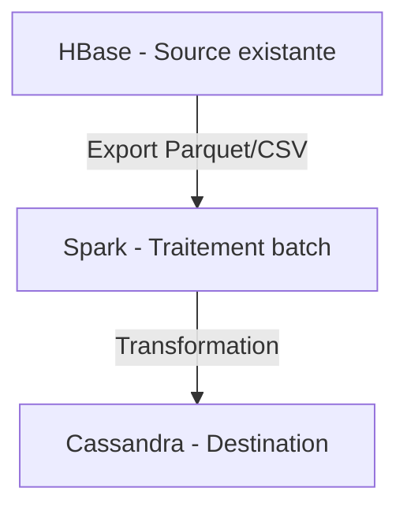
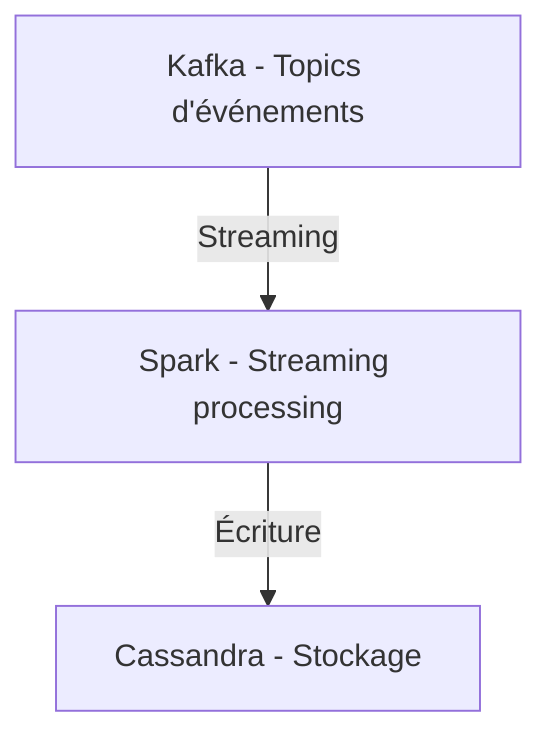
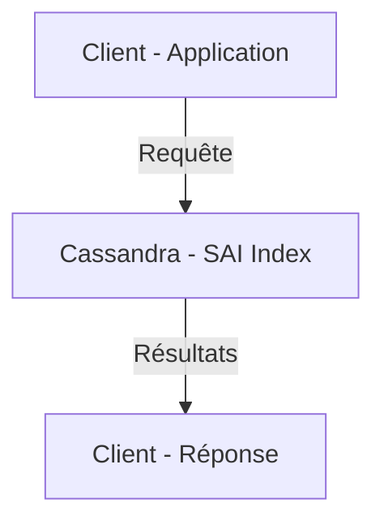

# 🏛️ Architecture - ARKEA

**Date** : 2026-03-16
**Objectif** : Architecture complète du projet ARKEA
**Version** : 2.0

---

## 📋 Table des Matières

- [Vue d'Ensemble](#vue-densemble)
- [Composants Principaux](#composants-principaux)
- [Flux de Données](#flux-de-données)
- [Architecture Technique](#architecture-technique)
- [Décisions Architecturales](#décisions-architecturales)

---

## 🎯 Vue d'Ensemble

Le projet **ARKEA** est un Proof of Concept (POC) démontrant la faisabilité de migrer une architecture HBase existante vers **Apache Cassandra 5.0** avec conteneurisation Podman.

### Objectif Principal

**Migrer** l'architecture HBase → Cassandra 5.0 en conservant :

- ✅ Fonctionnalités existantes
- ✅ Performance équivalente ou supérieure
- ✅ Compatibilité avec les applications existantes

---

## 🧩 Composants Principaux

### 1. Apache Cassandra 5.0.6

**Rôle** : Base de données cible

**Caractéristiques** :

- ✅ Stockage distribué
- ✅ SAI (Storage-Attached Index) pour recherche avancée
- ✅ Support full-text, fuzzy, vector search
- ✅ Data API (REST/GraphQL)

**Configuration (Podman)** :

- Host : `localhost`
- Port : `9102` (mappé depuis 9042 interne)
- Keyspace : `poc_hbase_migration` (configurable via `POC_KEYSPACE`)

**Conteneur** : `cassandra:5.0` (image Apache officielle)

---

### 2. Spark 3.5.1

**Rôle** : Traitement distribué et streaming

**Caractéristiques** :

- ✅ Batch processing (chargement de données)
- ✅ Streaming (Kafka → Cassandra)
- ✅ Spark SQL pour requêtes
- ✅ Intégration avec Cassandra via `spark-cassandra-connector`

**Configuration (Podman)** :

- Version : 3.5.1
- Master UI : `9280` (mappé depuis 8080 interne)
- Worker UI : `9281` (mappé depuis 8081 interne)
- Connector : `spark-cassandra-connector_2.12-3.5.0`

**Conteneur** : `apache/spark:3.5.1` (image Apache officielle)

---

### 3. Kafka 3.7.1

**Rôle** : Streaming de données en temps réel

**Caractéristiques** :

- ✅ Topics pour événements
- ✅ Intégration Spark Streaming
- ✅ Persistence des messages
- ✅ **KRaft mode** (sans Zookeeper)

**Configuration (Podman)** :

- Bootstrap Servers : `localhost:9192` (mappé depuis 9092 interne)
- Controller : `localhost:9193` (mappé depuis 9093 interne)
- Mode : KRaft (pas de Zookeeper)

**Conteneur** : `apache/kafka:3.7.1` (image Apache officielle)

---

### 4. Kafka UI

**Rôle** : Interface de gestion Kafka

**Caractéristiques** :

- ✅ Visualisation des topics
- ✅ Monitoring des consommateurs
- ✅ Gestion des messages

**Configuration (Podman)** :

- Port : `9190` (mappé depuis 8080 interne)

**Conteneur** : `provectuslabs/kafka-ui:latest`

---

## 🔄 Flux de Données

### Flux Principal : HBase → Cassandra



### Flux Streaming : Kafka → Cassandra



### Flux Recherche



---

## 🏗️ Architecture Technique

### Structure des Répertoires

```text
Arkea/
├── scripts/              # Scripts d'automatisation
│   ├── setup/           # Installation et configuration
│   ├── utils/           # Utilitaires
│   └── scala/           # Scripts Spark/Scala
│
├── schemas/             # Schémas CQL
│   └── kafka/           # Schémas Kafka
│
├── poc-design/          # POCs de démonstration
│   ├── domirama2/        # POC Domirama v2
│   ├── domiramaCatOps/   # POC Catégorisation
│   └── bic/              # POC BIC (Base d'Interaction Client)
│
├── docs/                 # Documentation
├── logs/                 # Logs
└── data/                 # Données temporaires
```

### Configuration Centralisée

**`.poc-config.sh`** :

- Variables d'environnement centralisées
- Détection automatique de l'OS (macOS/Linux)
- Priorité : Variables d'env > Fichier > Détection auto

**`.poc-profile`** :

- Source `.poc-config.sh`
- Fonctions utilitaires
- Initialisation de l'environnement

---

## 🎨 Patterns Architecturaux

### 1. Multi-Version / Time Travel

**Objectif** : Gérer différentes versions de données (batch vs. client)

**Implémentation** :

- Colonne `version` dans les tables
- Timestamps pour traçabilité
- Requêtes avec filtrage par version

### 2. SAI (Storage-Attached Index)

**Objectif** : Recherche avancée (full-text, fuzzy, vector)

**Types d'index** :

- **Full-text** : Recherche textuelle classique
- **Fuzzy** : Tolérance aux fautes de frappe
- **Vector** : Recherche sémantique (embeddings)

### 3. Hybrid Search

**Objectif** : Combiner full-text et vector search

**Implémentation** :

- Requêtes combinant SAI full-text et vector
- Scoring unifié
- Optimisation de la pertinence

---

## 🔐 Sécurité

### Authentification

- **Cassandra** : Authentification standard
- **Data API** : Token-based authentication
- **Kafka** : SASL/SSL (optionnel)
- **Podman** : Isolation réseau 5-couches

### Configuration

- Variables sensibles via variables d'environnement
- Pas de secrets hardcodés
- `.gitignore` pour fichiers locaux

---

## 📊 Performance

### Optimisations

- ✅ **Parquet** : Format columnar pour exports
- ✅ **Compaction** : Gestion automatique des tombstones
- ✅ **Indexing** : SAI pour recherche rapide
- ✅ **Batch Loading** : Spark pour chargement massif

### Monitoring

- Logs dans `logs/`
- Métriques Cassandra via `nodetool`
- Métriques Spark via UI (port 9280)
- Kafka UI (port 9190)

---

## 🚀 Scalabilité

### Horizontal Scaling

- **Cassandra** : Cluster multi-nœuds
- **Spark** : Cluster distribué
- **Kafka** : Partitionnement des topics

### Vertical Scaling

- Configuration des ressources (mémoire, CPU)
- Tuning des paramètres JVM
- Podman resource limits (voir `podman-compose.yml`)

---

## 📝 Décisions Architecturales

### ADR-001 : Choix de Cassandra 5.0

**Contexte** : Migration HBase → Cassandra

**Décision** : Utiliser Apache Cassandra 5.0.6

**Justification** :

- ✅ Dernière version stable avec SAI natif
- ✅ Compatibilité avec écosystème Cassandra
- ✅ SAI pour recherche avancée (full-text, vector)
- ✅ Images Docker/Podman officielles Apache
- ✅ Communauté active et support

**Conséquences** :

- Nécessite adaptation des schémas HBase → CQL
- Migration des données via Spark
- Conteneurisation via Podman

---

### ADR-002 : Format Parquet pour Exports

**Contexte** : Format d'export des données

**Décision** : Utiliser Parquet au lieu de CSV

**Justification** :

- ✅ Performance supérieure (columnar)
- ✅ Compression efficace
- ✅ Support natif Spark
- ✅ Schéma préservé

**Conséquences** :

- Nécessite conversion CSV → Parquet
- Outils compatibles Parquet requis

---

### ADR-003 : Configuration Centralisée

**Contexte** : Gestion des chemins et variables

**Décision** : `.poc-config.sh` avec détection automatique

**Justification** :

- ✅ Portabilité (macOS/Linux)
- ✅ Maintenance facilitée
- ✅ Priorité claire (env > config > auto)

**Conséquences** :

- Migration des scripts existants
- Documentation à jour

---

## 🔄 Évolution Future

### Court Terme

- ✅ Tests automatisés
- ✅ CI/CD complet
- ✅ Documentation complète

### Moyen Terme

- 🔄 Déploiement en production
- 🔄 Monitoring avancé
- 🔄 Optimisations performance

### Long Terme

- 🔄 Multi-cluster
- 🔄 Disaster recovery
- 🔄 Backup/restore automatisé

---

## 📚 Références

- `docs/ARCHITECTURE_POC_COMPLETE.md` - Architecture détaillée du POC
- `docs/DEPLOYMENT.md` - Guide de déploiement
- `docs/TROUBLESHOOTING.md` - Guide de dépannage
- `README.md` - Vue d'ensemble du projet

---

**Date** : 2026-03-16
**Version** : 2.0
**Statut** : ✅ **Documentation complète - Cassandra 5.0**
