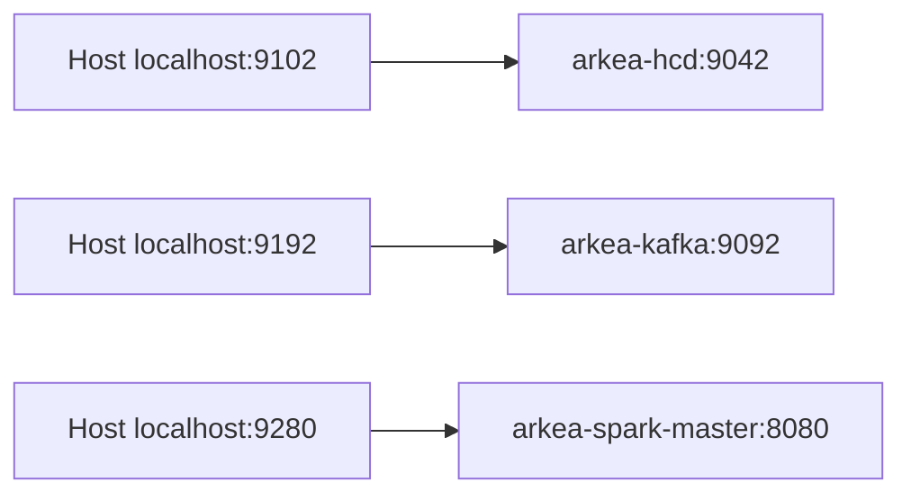

# START_HERE.md

**Date** : 2026-03-20
**POC** : Arkea — Cassandra OSS 5.0 (Active Leg)
**TL;DR** : Utiliser le leg actif `ARKEA_LEG=podman` avec ports hôte `9102` (CQL), `9192` (Kafka), `9280` (Spark UI).

---

## 1) Démarrage en 3 étapes

```bash
make setup
make start
make status
```

Puis vérifier la conformité active :

```bash
make audit-active
```

---

## 2) Runtime Mapping (Host ↔ Container)



> Les ports `9042/9092` sont des ports **internes conteneur** sur le leg Podman.

---

## 3) Règles clés

- ✅ Par défaut : `ARKEA_LEG=podman`
- ⚠️ Legacy binaire : nécessite `ARKEA_ENABLE_BINARY_LEG=1`
- ✅ Préférer `make` aux scripts individuels
- ✅ Vérifier avant PR/demo : `make check` puis `make audit-active`

---

## 4) Politique de test (A+)

- ✅ PR quick gate : `make check-ports`, `make audit-active`, `make check-consistency-active`, `make test-all`
- ✅ Active gate strict : `make check`, `make audit-active`, `make test-runtime-policy-strict` avec stack Podman démarrée
- ✅ Local dev : `make test-runtime-policy` autorise le skip du smoke port si la stack n'est pas lancée
- ✅ Objectif CI : aucun skip inattendu sur le gate actif strict

---

## 5) Commandes utiles

```bash
make check-consistency-active
make check-ports
make test-runtime-policy
make test-runtime-policy-strict
make test-all
```
